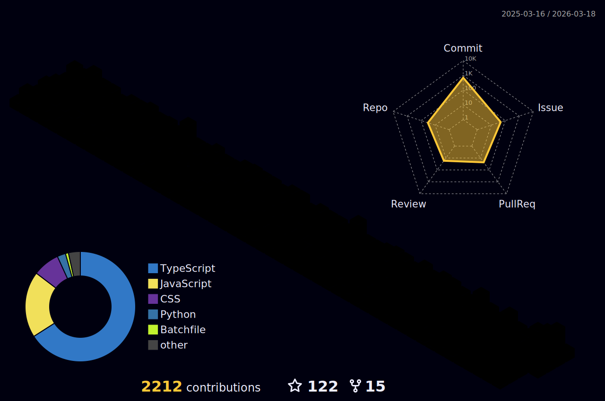

#  _Cactus ❤️ Open Source_

<h1 align="center">
  
</h1>

## 🌐Socials

     

# 💻Tech Stack

                                                 

## 📊Some of my GitHub Stats

   
  

   

### ✍️Random Dev Quote

### 😂Random Dev Meme

## 💰You can help me by Donating

   

<!--
**erbanku/erbanku** is a ✨ _special_ ✨ repository because its `README.md` (this file) appears on your GitHub profile.

Here are some ideas to get you started:

- 🔭 I’m currently working on ...
- 🌱 I’m currently learning ...
- 👯 I’m looking to collaborate on ...
- 🤔 I’m looking for help with ...
- 💬 Ask me about ...
- 📫 How to reach me: ...
- 😄 Pronouns: ...
- ⚡ Fun fact: ...
-->
